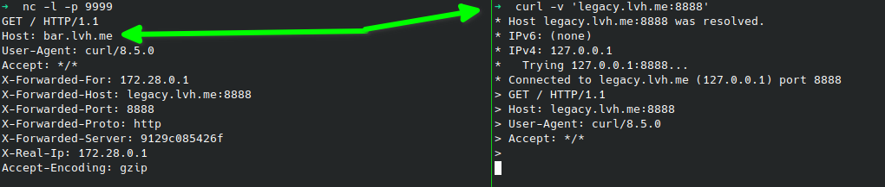

# Traefik Host Header Rewrite Example

This project demonstrates a live example of **Traefik** acting as reverse proxy that modifies the `Host` header before forwarding the HTTP request to the target server.

## Purpose

The primary goal is to show how Traefik can route traffic based on a specific `Host` header (e.g., `caddy-in-docker.lvh.me`)
and then rewrite that header to a different value (e.g., `caddy.lvh.me`) required by the backend application.

This is particularly useful when:
- The backend application is configured to respond only to a specific domain.
- You want to proxy traffic from an external domain to an internal domain that differs from the original request.

## Getting Started

1. Create the shared network:
```bash
docker network create rewrite
```

2. Start Traefik:
```bash
docker compose up -d
```

3. Start the backend services:
Go to each directory and start the containers:
```bash
cd caddy && docker compose up -d && cd ..
cd podinfo && docker compose up -d && cd ..
```

## Verification

You can verify the setup using `curl`. Traefik is exposed on port `8888`.

### Testing Caddy Rewrite
Send a request to `caddy-in-docker.lvh.me:8888`. Traefik will rewrite the `Host` header to `caddy.lvh.me`.

```bash
curl -v 'caddy-in-docker.lvh.me:8888'
....
< HTTP/1.1 200 OK
< Accept-Ranges: bytes
< Content-Length: 150
< Content-Type: text/html; charset=utf-8
< Date: Tue, 14 Apr 2026 18:57:43 GMT
< Etag: "dhsahjzajaio46"
< Last-Modified: Mon, 13 Apr 2026 19:55:09 GMT
< Server: Caddy
< Vary: Accept-Encoding
<
{ [150 bytes data]
* Connection #0 to host caddy-in-docker.lvh.me left intact
<!DOCTYPE html>
<html lang="">
  <head>
    <meta charset="utf-8">
    <title></title>
  </head>
  <body>
    <h1>caddy.lvh.me</h1>
  </body>
</html>
```

### Testing File Provider (Legacy Service)
This setup also uses Traefik's File Provider to route traffic to a local service running outside of Docker.

1. Run a local server on port `9999`:
```bash
nc -l -p 9999
```

2. Send a request to `legacy.lvh.me:8888`:
```bash
curl -v 'legacy.lvh.me:8888'
```

3. In the terminal where `nc` is running, you should see the incoming HTTP request with the rewritten `Host` header:
```text
GET / HTTP/1.1
Host: bar.lvh.me
User-Agent: curl/8.5.0
Accept: */*
X-Forwarded-For: 172.28.0.1
X-Forwarded-Host: legacy.lvh.me:8888
X-Forwarded-Port: 8888
X-Forwarded-Proto: http
X-Forwarded-Server: 9129c085426f
X-Real-Ip: 172.28.0.1
Accept-Encoding: gzip
```



#### Incorrect Host

If we modify the `rewrite-host-caddy` middleware in `caddy/docker-compose.yml`
to set a `Host` header that is not configured in Caddy (e.g., `wrong.lvh.me` instead of `caddy.lvh.me`):

```yaml
# Middleware to change Host header to an unsupported one
- "traefik.http.middlewares.rewrite-host-caddy.headers.customrequestheaders.Host=wrong.lvh.me"
```
We will see an empty response from Caddy:

```bash
curl -v 'caddy-in-docker.lvh.me:8888'
* Host caddy-in-docker.lvh.me:8888 was resolved.
* IPv6: (none)
* IPv4: 127.0.0.1
*   Trying 127.0.0.1:8888...
* Connected to caddy-in-docker.lvh.me (127.0.0.1) port 8888
> GET / HTTP/1.1
> Host: caddy-in-docker.lvh.me:8888
> User-Agent: curl/8.8.0
> Accept: */*
>
* Request completely sent off
< HTTP/1.1 200 OK
< Content-Length: 0
< Date: Tue, 14 Apr 2026 18:56:55 GMT
< Server: Caddy
<
* Connection #0 to host caddy-in-docker.lvh.me left intact
```

### Many Virtual Hosts

This example demonstrates how to handle a backend HTTP server that hosts multiple applications (Virtual Hosts) and relies on the `Host` header to distinguish between them.

#### The Problem

Traefik currently does not support dynamic header rewriting based on request attributes (e.g., regex captures from the original domain).
This is a known issue:

* [Traefik header transformation](https://github.com/traefik/traefik/issues/6047)
* [Custom Variables in Proxy Headers](https://github.com/traefik/traefik/issues/5036)

This scenario is common in legacy projects where a single HTTP server (like Apache or Nginx) hosts many websites/applications on one server.

#### The Workaround

In this demo (`/manyvhost` directory), we use a Caddy instance as an intermediate proxy between Traefik and the final backend.
1. Traefik routes the traffic and passes the original host in `X-Forwarded-Host`.
2. Caddy captures the subdomain from `X-Forwarded-Host` and performs the dynamic `Host` header rewrite before forwarding the request to the target server.

#### Verification

1. Start the manyvhost services:
```bash
cd manyvhost && docker compose up -d && cd ..
```

2. Test admin application:
```bash
curl -v 'admin5.app.lvh.me:8888'
# You should see content from webroot-admin/index.html
```

3. Test panel application:
```bash
curl -v 'panel5.app.lvh.me:8888'
# You should see content from webroot-panel/index.html
```
