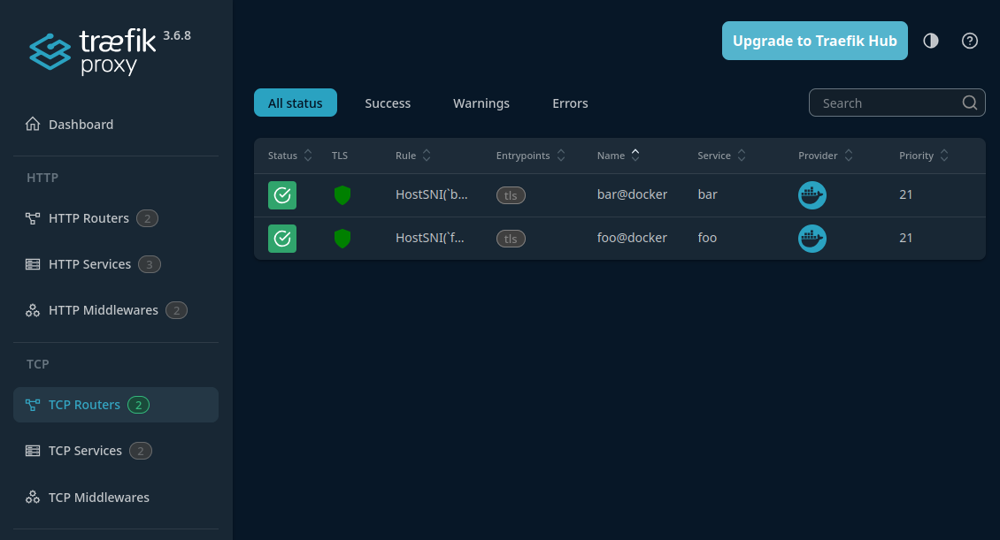

# Traefik - SNI load balancer

This project demonstrates how to set up a Traefik-based load balancer that uses SNI (Server Name Indication) to route TLS traffic to different backend services based on SNI value.

## Usage

Create a dedicated Docker network that will be shared by Traefik and the backend services: `docker network create sni`.

Start Traefik: `docker compose up -d`.

Next, go to the `foo` directory and run `docker compose up -d` to start foo service.

Then go back to the root directory, enter the `bar` directory, and run: `docker compose up -d` to start the bar service.

In the Traefik dashboard (`localhost:8080`), you should see two registered TCP Routers and Services.

After that, you can test routing by sending HTTPS requests with different hostnames to verify that traffic is forwarded to the correct backend based on the SNI value.
